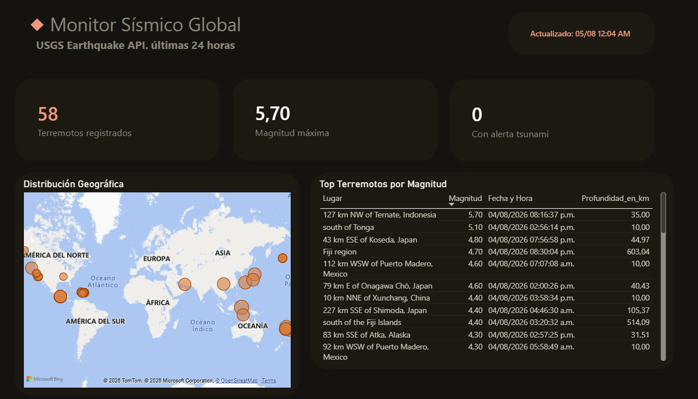
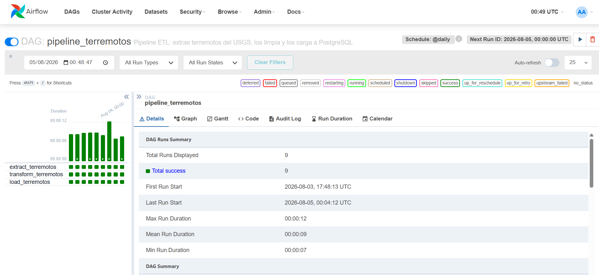

# Pipeline ETL de Terremotos con Airflow, PostgreSQL y Power BI

Pipeline de datos end-to-end: extrae eventos sísmicos en tiempo real desde la API pública del **USGS**, los limpia con **Python/pandas**, los carga en **PostgreSQL**, y orquesta todo el proceso con **Apache Airflow**. Incluye un dashboard interactivo en **Power BI** conectado en vivo (DirectQuery).


## Dashboard



*Conectado vía DirectQuery — los datos se actualizan en vivo desde PostgreSQL cada vez que se abre el reporte.*

## Pipeline funcionando en Airflow



*Las 3 tareas (extract → transform → load) corriendo en cadena, con reintentos configurados.*

## Arquitectura

```
API pública (USGS Earthquakes)
        │
        ▼
   extract.py  ──►  guarda JSON crudo
        │
        ▼
  transform.py ──►  limpia con pandas, guarda CSV
        │
        ▼
    load.py    ──►  inserta en PostgreSQL (tabla "terremotos")
        │
        ▼
  Orquestado por Airflow (DAG: pipeline_terremotos)
  Programado @daily, con reintentos automáticos
        │
        ▼
   Power BI (DirectQuery) ──► Dashboard en vivo
```

**Stack:** Docker + Docker Compose · Apache Airflow 2.9.3 (CeleryExecutor) · PostgreSQL 15 · Python (pandas, requests, psycopg2) · Power BI

## Qué hace el pipeline

1. **Extract** — Consulta la API pública del USGS (`earthquake.usgs.gov`), trayendo todos los sismos de magnitud ≥2.5 registrados en las últimas 24 horas. Las fechas se calculan dinámicamente en cada corrida.
2. **Transform** — Aplana la estructura GeoJSON con pandas: conversión de timestamps, manejo de nulos, tipado correcto de columnas, eliminación de duplicados.
3. **Load** — Inserta los datos limpios en PostgreSQL con SQL parametrizado (`CREATE TABLE IF NOT EXISTS`, `INSERT` con placeholders — protegido contra SQL injection).
4. **Orquestación** — Un DAG de Airflow encadena las 3 etapas (`extract >> transform >> load`), con reintentos automáticos y ejecución diaria programada.
5. **Visualización** — Power BI se conecta directamente a PostgreSQL en modo DirectQuery, por lo que el dashboard siempre refleja el estado actual de la base, sin necesidad de refrescos manuales de datos importados.

## Estructura del repositorio

```
data_pipeline_project/
├── docker-compose.yaml     # Stack de Airflow + PostgreSQL + Redis
├── dags/
│   └── pipeline_terremotos.py
├── scripts/
│   ├── extract.py
│   ├── transform.py
│   └── load.py
├── dashboard_terremotos.pbix
└── screenshots/
```

## Cómo correrlo localmente

```bash
git clone <url-del-repo>
cd data_pipeline_project
echo "AIRFLOW_UID=50000" > .env
docker compose up airflow-init
docker compose up -d
```

Accedé a Airflow en `http://127.0.0.1:8080` (usuario/contraseña: `airflow`/`airflow` en el primer arranque).

## Decisiones técnicas destacables

- **Rutas robustas basadas en `__file__`**: los scripts calculan la ubicación de la carpeta `data/` en base a su propia posición en disco, no al directorio de ejecución — necesario porque el mismo código corre tanto localmente como dentro de los contenedores de Airflow, cada uno con un working directory distinto.
- **`_PIP_ADDITIONAL_REQUIREMENTS`**: usado por simplicidad para instalar `pandas`/`psycopg2` en los contenedores de Airflow. En un entorno de producción real, la alternativa correcta sería extender la imagen oficial con un `Dockerfile` propio.
- **Dos instancias de PostgreSQL separadas**: una interna de Airflow (metadata de ejecución) y una propia para los datos del proyecto — mantiene limpia la separación entre infraestructura de orquestación y datos de negocio.
- **`CeleryExecutor`** en vez de `LocalExecutor`: se eligió deliberadamente el stack completo (worker + scheduler + Redis) para reflejar un entorno más cercano a producción, no la versión simplificada.

## Autor

**Iván Elías Orquera** — Data Analyst Jr. en formación como Data Engineer
[LinkedIn](https://www.linkedin.com/in/ivanorquera9/) · [GitHub](https://github.com/ivanorquera95)
